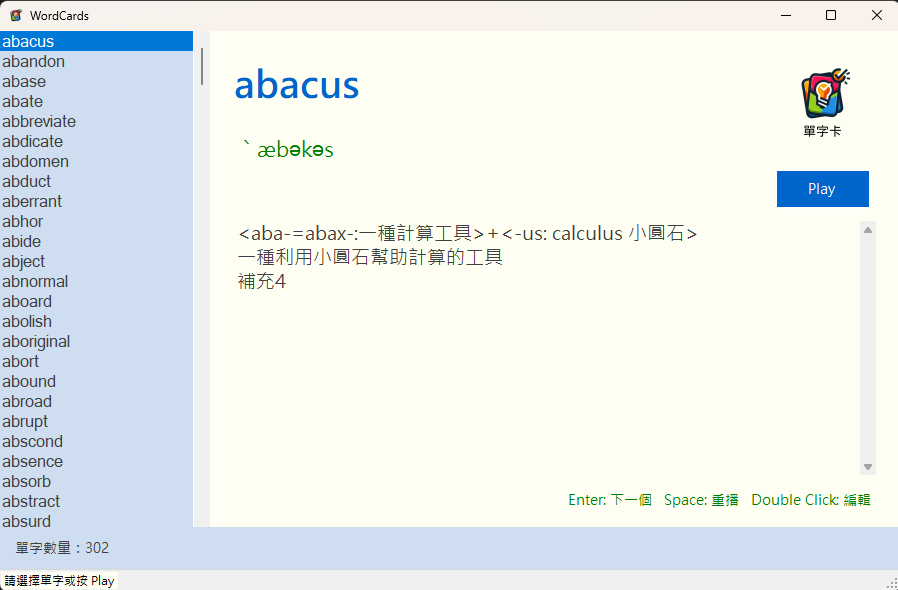

# word-cards

一個基於 C# Windows Forms 開發的智慧英語單字卡學習系統。本專案為視窗程式設計 (II) 課程的單字卡設計練習，透過強大的動態控制項排版、外部 COM 元件整合與單字資料序列化技術，實現了一個集單字瀏覽、自動播放發音、即時編輯與儲存於一體的英語學習工具。

## 畫面截圖

## 核心功能

- **單字清單瀏覽與檢索**：左側整合了高效的 `ListBox` 清單，載入外部單字庫，雙擊或點擊即可即時於主介面展示對應的單字、音標與詳細中文釋義。
- **語音播放與自動播卡**：整合 Windows Media Player 播放核心，載入單字專屬的 MP3 發音檔。點擊 **Play** 可進入自動播卡模式，系統將定時自動切換單字並同步發音。
- **即時編輯與持久化儲存**：雙擊單字清單即可開啟獨立的 `frmEditWord` 視窗，提供直覺的編輯表單。儲存後系統會自動將修改後的資料即時序列化並覆寫回單字庫文字檔 (`WordCards.txt`)。
- **熱鍵輔助極速學習**：全面支援鍵盤快捷鍵操控。使用者只需按下 `Enter` 鍵即可切換至下一張字卡，按下 `Space`（空白鍵）則能立刻重複播放當前單字發音。

## 開發技術亮點

本專案展示了底層控制項佈局、多媒體整合及資料處理的實戰技巧：

1. **COM 元件動態載入 (`WMPlayer.OCX`)**：
   突破傳統內建音效播放限制，透過反射機制在執行階段動態取得 `WMPlayer.OCX` 的 ProgID 註冊，並使用動態物件 (`dynamic`) 調用控制其音量、靜音及媒體播放，具備極佳的靈活性。

2. **自適應視窗動態佈局**：
   捨棄了 Visual Studio 預設生成的 Designer 靜態程式碼，全面使用 C# 程式碼動態宣告、配置與加入控制項。並實作 `LayoutMainPanel` 事件處理函式，動態計算控制項在視窗縮放時的相對座標與寬高，達到完美的響應式視窗效果。

3. **強大的 C# 10 與 4.7.2 混合架構**：
   專案在傳統 `.NET Framework 4.7.2` 的基礎上，透過在 `.csproj` 配置 `<LangVersion>10.0</LangVersion>` 引入了 C# 10.0 編譯特性。運用了「檔案範圍命名空間 (File-scoped namespaces)」、「全域引用 (Global Usings)」、「可為 Null 的參考型別 (Nullable reference types)」等現代語法，讓傳統架構的程式碼更加乾淨俐落。

4. **單字庫檔案序列化 (TSV 解析)**：
   實作了 `WordItem` 與 `WordCollection` 來負責單字資料的載入與寫入。以 Tab (\t) 分隔的檔案結構 (TSV) 進行資料持久化，並在寫回檔案前對多行中文釋義的換行符號 (`\r\n`) 進行編碼轉換，確保檔案讀寫的一致性與安全性。

## 如何執行

1. 使用 Visual Studio 開啟本專案的解決方案檔 `WordCards.slnx` 或 `WordCards.csproj`。
2. 按下 `F5` 或點擊 **開始** 按鈕編譯並執行程式。
3. 程式會自動載入同目錄下的單字檔 `WordCards.txt` 與 `Sound` 資料夾中的 MP3 音效。
4. 點擊單字即可查看與播放發音，點擊 **Play** 進行自動播卡，或雙擊單字開啟編輯視窗。